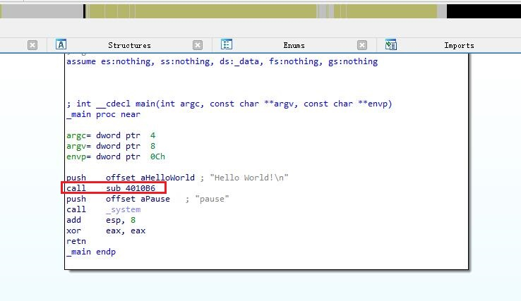
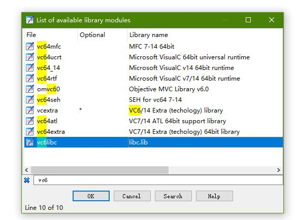
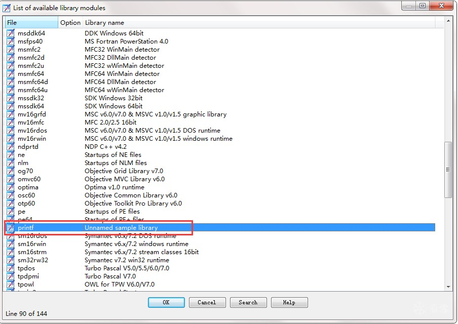
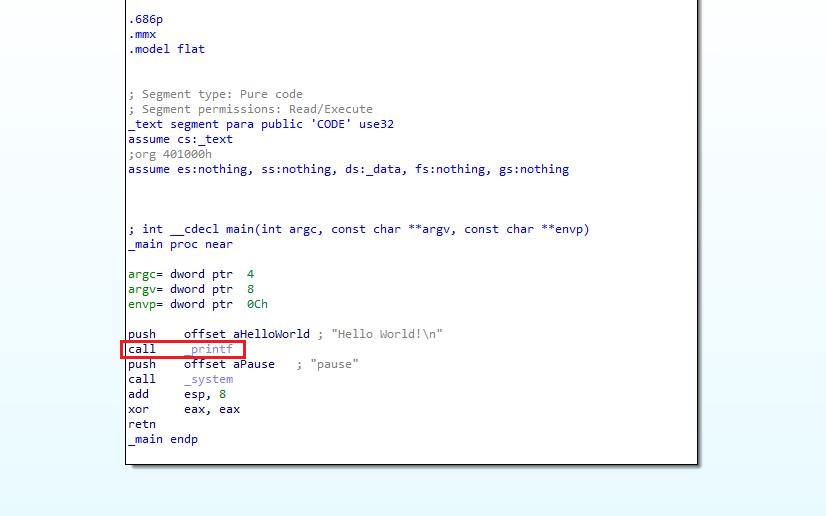

### IDASigMaker

该技术使IDA能够识别由受支持的编译器生成的标准库函数， 并大大提高了所生成的汇编的可用性和可读性。

##### 原帖子

[逆向技术之熟悉IDA工具](https://bbs.pediy.com/thread-224499.htm)


#### 使用方法

以 D:\Program Files\Microsoft Visual Studio\VC98\Lib\LIBC.LIB 为例子

cmd下运行  lib2sig.bat  参数lib的名字

```
lib2sig.bat libc
```

```
自动创建文件夹libc_objs，将LIBC.LIB拷入，按任意键继续执行。

中间有提示按回车的，按回车

生成 libc.sig，改名为vc6libc.sig(已经存在一个)，拷贝到IDA的sig/pc下，有目录限制的。

在IDA shift+F5 --> 右键 Apply new signature...，搜索vc6lib,应用。

就可以识别了
```


##### 贴图说明

ida原生显示




方法1：导入整个lib的sig
 



方法2：导入单个api的sig



 
导入sig的效果




##### 参考资料

[https://www.hex-rays.com/products/ida/tech/flirt/index.shtml](https://www.hex-rays.com/products/ida/tech/flirt/)


[IDA pro Flair 制作静态库文件签名 (图文教程)](https://blog.csdn.net/cwg2552298/article/details/81749521)


##### 一些制作好sig文件

[FLIRT Signature File Database](https://github.com/Maktm/FLIRTDB)


[IDA FLIRT Signature Database](https://github.com/push0ebp/sig-database)


